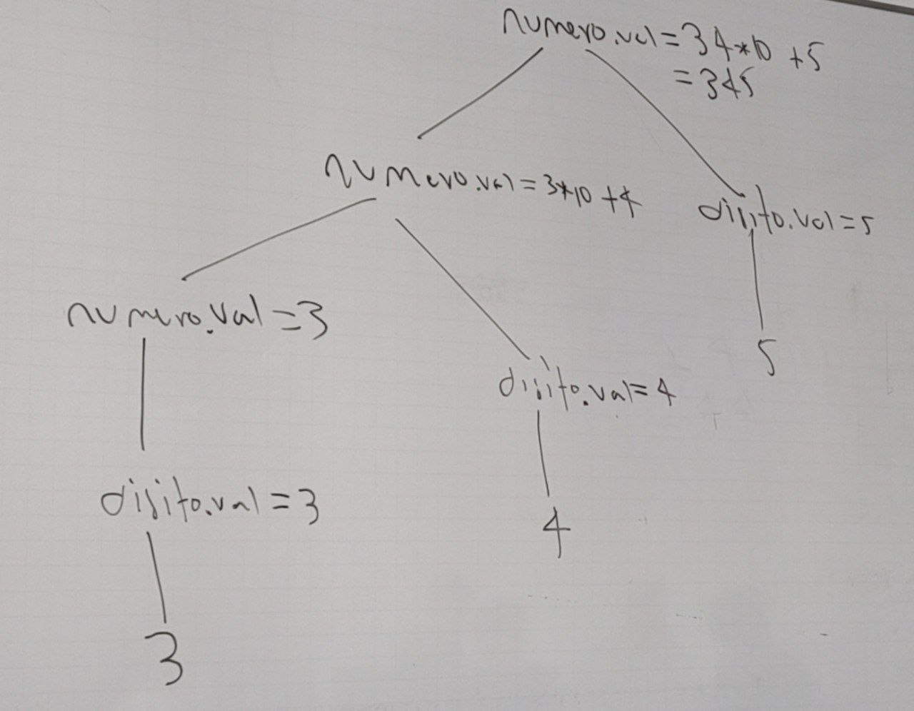

# Analisis semantico

Es lo que le da el significado a las lineas, le da sentido a las cadenas que estan sintacticamente correctas

### Algunos ejemplos del español

- La secretaria fue violentada
- La secretaría fue violentada

---

- No cazar animales
- No cazar, animales

El analisis semantico tambien da al sistema operativo información clave para poder manejar los datos de un scripts

| Regla gramatical | Reglas semánticas                |
| ---------------- | -------------------------------- |
| Regla 1          | Ecuaciones de atributo asociadas |
| Regla n          | algo                             |

### Ejemplo #1

Sea la gramatica

```
Número -> número digito | número
digito -> [0|9]
```

| Regla gramatical | Reglas semánticas       |
| ---------------- | ----------------------- |
| numero -> digito | numero.val = digito.val |
| digito -> 0      | digito.val = 0          |

### Ejemplo #2

Usando la gramatica anterior, generar el número 34

```
numero -> numero digito
numero -> digito digito
digito -> 3 digito
digito -> 3 4
```

Para convertir la cadera "3 4", se ha de usar la matematica discreta de la siguiente manera

```
3 _ 10^1 + 4 _ 10^0
```

### Ejemplo #3

Usando la gramatica anterior, generar el número 34

```
numero -> numero digito digito
numero -> digito digito digito
digito -> 2 digito digito
digito -> 2 4 digito
digito -> 2 4 4
```

| Regla gramatical               | Reglas semánticas                                              |
| ------------------------------ | -------------------------------------------------------------- |
| numero -> numero digito digito | numero.val = numero2.val _ 10^2 + digito.val _ 10 + digito.val |
| numero -> digito               | numero.val = digito.val                                        |
| digito -> 0                    | digito.val = 0                                                 |
| digito -> 1                    | digito.val = 1                                                 |
| digito -> 2                    | digito.val = 2                                                 |
| digito -> 3                    | digito.val = 3                                                 |
| digito -> 4                    | digito.val = 4                                                 |
| digito -> 5                    | digito.val = 5                                                 |
| digito -> 6                    | digito.val = 6                                                 |
| digito -> 7                    | digito.val = 7                                                 |
| digito -> 8                    | digito.val = 8                                                 |
| digito -> 9                    | digito.val = 9                                                 |

### Ejercicios

Usando la gramatica

```
Número -> número digito | número
digito -> [0|9]
```

Generar los número:

- 1567
- 2897234
- 454567899
- 343456767879

### Soluciones

Para el número: 1567

```
numero -> numero digito
numero -> numero digito digito
numero -> numero digito digito digito
numero -> digito digito digito digito
digito -> 1 digito digito digito
digito -> 1 5 digito digito
digito -> 1 5 6 digito
digito -> 1 5 6 7
```

| Regla gramatical                      | Reglas semánticas                                                                       |
| ------------------------------------- | --------------------------------------------------------------------------------------- |
| numero -> numero digito digito digito | numero.val = numero3.val \* 10^3 + digito.val \* 10^2 + digito.val \* 10^1 + digito.val |
| numero -> digito                      | numero.val = digito.val                                                                 |
| digito -> 0                           | digito.val = 0                                                                          |
| digito -> 1                           | digito.val = 1                                                                          |
| digito -> 2                           | digito.val = 2                                                                          |
| digito -> 3                           | digito.val = 3                                                                          |
| digito -> 4                           | digito.val = 4                                                                          |
| digito -> 5                           | digito.val = 5                                                                          |
| digito -> 6                           | digito.val = 6                                                                          |
| digito -> 7                           | digito.val = 7                                                                          |
| digito -> 8                           | digito.val = 8                                                                          |
| digito -> 9                           | digito.val = 9                                                                          |

Para el número: 2897234

```
numero -> numero digito
numero -> numero digito digito
numero -> numero digito digito digito
numero -> numero digito digito digito digito
numero -> numero digito digito digito digito digito
numero -> numero digito digito digito digito digito digito
numero -> digito digito digito digito digito digito digito
digito -> 2 digito digito digito digito digito digito
digito -> 2 8 digito digito digito digito digito
digito -> 2 8 9 digito digito digito digito
digito -> 2 8 9 7 digito digito digito
digito -> 2 8 9 7 2 digito digito
digito -> 2 8 9 7 2 3 digito
digito -> 2 8 9 7 2 3 4
```

| Regla gramatical                                           | Reglas semánticas                                                                                                                                      |
| ---------------------------------------------------------- | ------------------------------------------------------------------------------------------------------------------------------------------------------ |
| numero -> numero digito digito digito digito digito digito | numero.val = numero6.val \* 10^6 + digito.val \* 10^5 + digito.val \* 10^4 + digito.val \* 10^3 + digito.val \* 10^2 + digito.val \* 10^1 + digito.val |
| numero -> digito                                           | numero.val = digito.val                                                                                                                                |
| digito -> 0                                                | digito.val = 0                                                                                                                                         |
| digito -> 1                                                | digito.val = 1                                                                                                                                         |
| digito -> 2                                                | digito.val = 2                                                                                                                                         |
| digito -> 3                                                | digito.val = 3                                                                                                                                         |
| digito -> 4                                                | digito.val = 4                                                                                                                                         |
| digito -> 5                                                | digito.val = 5                                                                                                                                         |
| digito -> 6                                                | digito.val = 6                                                                                                                                         |
| digito -> 7                                                | digito.val = 7                                                                                                                                         |
| digito -> 8                                                | digito.val = 8                                                                                                                                         |
| digito -> 9                                                | digito.val = 9                                                                                                                                         |

Para el número: 454567899

```
numero -> numero digito
numero -> numero digito digito
numero -> numero digito digito digito
numero -> numero digito digito digito digito
numero -> numero digito digito digito digito digito
numero -> numero digito digito digito digito digito digito
numero -> numero digito digito digito digito digito digito digito
numero -> numero digito digito digito digito digito digito digito digito
numero -> digito digito digito digito digito digito digito digito digito
digito -> 4 digito digito digito digito digito digito digito digito
digito -> 4 5 4 digito digito digito digito digito digito
digito -> 4 5 4 5 digito digito digito digito digito
digito -> 4 5 4 5 6 digito digito digito digito
digito -> 4 5 4 5 6 7 digito digito digito
digito -> 4 5 4 5 6 7 8 digito digito
digito -> 4 5 4 5 6 7 8 9 digito
digito -> 4 5 4 5 6 7 8 9 9
```

| Regla gramatical                                           | Reglas semánticas                                                                                                                                      |
| ---------------------------------------------------------- | ------------------------------------------------------------------------------------------------------------------------------------------------------ |
| numero -> numero digito digito digito digito digito digito digito digito | numero.val = numero8.val \* 10^8 + digito.val \* 10^7 + digito.val \* 10^6 + digito.val \* 10^5 + digito.val \* 10^4 + digito.val \* 10^3 + digito.val \* 10^2 + digito.val \* 10^1 + digito.val |
| numero -> digito                                           | numero.val = digito.val                                                                                                                                |
| digito -> 0                                                | digito.val = 0                                                                                                                                         |
| digito -> 1                                                | digito.val = 1                                                                                                                                         |
| digito -> 2                                                | digito.val = 2                                                                                                                                         |
| digito -> 3                                                | digito.val = 3                                                                                                                                         |
| digito -> 4                                                | digito.val = 4                                                                                                                                         |
| digito -> 5                                                | digito.val = 5                                                                                                                                         |
| digito -> 6                                                | digito.val = 6                                                                                                                                         |
| digito -> 7                                                | digito.val = 7                                                                                                                                         |
| digito -> 8                                                | digito.val = 8                                                                                                                                         |
| digito -> 9                                                | digito.val = 9                                                                                                                                         |


Para el número: 343456767879

```
numero -> numero digito
numero -> numero digito digito
numero -> numero digito digito digito
numero -> numero digito digito digito digito
numero -> numero digito digito digito digito digito
numero -> numero digito digito digito digito digito digito
numero -> numero digito digito digito digito digito digito digito
numero -> numero digito digito digito digito digito digito digito digito
numero -> numero digito digito digito digito digito digito digito digito digito
numero -> numero digito digito digito digito digito digito digito digito digito digito
numero -> numero digito digito digito digito digito digito digito digito digito digito digito
numero -> digito digito digito digito digito digito digito digito digito digito digito digito
digito -> 3 digito digito digito digito digito digito digito digito digito digito digito
digito -> 3 4 digito digito digito digito digito digito digito digito digito digito
digito -> 3 4 3 digito digito digito digito digito digito digito digito digito
digito -> 3 4 3 4 digito digito digito digito digito digito digito digito
digito -> 3 4 3 4 5 digito digito digito digito digito digito digito
digito -> 3 4 3 4 5 6 digito digito digito digito digito digito
digito -> 3 4 3 4 5 6 7 digito digito digito digito digito
digito -> 3 4 3 4 5 6 7 6 digito digito digito digito
digito -> 3 4 3 4 5 6 7 6 7 digito digito digito
digito -> 3 4 3 4 5 6 7 6 7 8 digito digito
digito -> 3 4 3 4 5 6 7 6 7 8 7 digito
digito -> 3 4 3 4 5 6 7 6 7 8 7 9
```

| Regla gramatical                                           | Reglas semánticas                                                                                                                                      |
| ---------------------------------------------------------- | ------------------------------------------------------------------------------------------------------------------------------------------------------ |
| numero -> numero digito digito digito digito digito digito digito digito | numero.val = numero8.val \* 10^8 + digito.val \* 10^7 + digito.val \* 10^6 + digito.val \* 10^5 + digito.val \* 10^4 + digito.val \* 10^3 + digito.val \* 10^2 + digito.val \* 10^1 + digito.val |
| numero -> digito                                           | numero.val = digito.val                                                                                                                                |
| digito -> 0                                                | digito.val = 0                                                                                                                                         |
| digito -> 1                                                | digito.val = 1                                                                                                                                         |
| digito -> 2                                                | digito.val = 2                                                                                                                                         |
| digito -> 3                                                | digito.val = 3                                                                                                                                         |
| digito -> 4                                                | digito.val = 4                                                                                                                                         |
| digito -> 5                                                | digito.val = 5                                                                                                                                         |
| digito -> 6                                                | digito.val = 6                                                                                                                                         |
| digito -> 7                                                | digito.val = 7                                                                                                                                         |
| digito -> 8                                                | digito.val = 8                                                                                                                                         |
| digito -> 9                                                | digito.val = 9                                                                                                                                         |

Calcular el arbol de derivación por la izquierda para:

- 19
- 953
- 15678
- 34768
- 8546865



