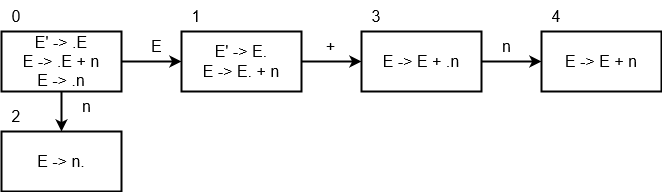
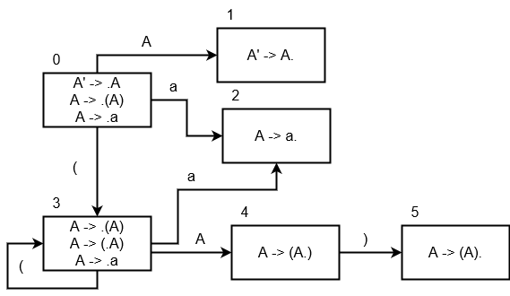

# Ejemplo #1

Sea la gramatica:

```
E' -> E
E -> E + n | n
```

Utilizar el algoritmo LR(0) para la cadena:

n + n

---



| Pasos | Pila     | Cadena | Acciones           |
| ----- | -------- | ------ | ------------------ |
| 1     | $0       | n+n$   | Desplazar          |
| 2     | $0n2     | +n$    | Reducir E -> n     |
| 3     | $0E1     | +n$    | Desplazar          |
| 4     | $0E1+3   | n$     | Desplazar          |
| 5     | $0E1+3n4 | $      | Reducir E -> E + n |
| 6     | $0E1     | $      | Aceptar            |

# Ejemplo #2

Sea la gramatica:

```
A' -> A
A -> (A) | a
```

Utilizar el algoritmo LR(0) para la cadena:

((a))

---




| Pasos | Pila       | Cadena | Acciones         |
| ----- | ---------- | ------ | ---------------- |
| 1     | $0         | ((a))$ | Desplazar        |
| 2     | $0(3       | (a))$  | Desplazar        |
| 3     | $0(3(3     | a))$   | Desplazar        |
| 4     | $0(3(3a2   | ))$    | Reducir A -> a   |
| 5     | $0(3(3A4   | ))$    | Desplazar        |
| 6     | $0(3(3A4)5 | )$     | Reducir A -> (A) |
| 7     | $0(3(3A4   | )$     | Desplazar        |
| 8     | $0(3(3A4)5 | $      | Reducir A -> (A) |
| 9     | $0A1       | $      | Aceptar          |

# Ejercicio #1

Sea la gramatica:

```
E' -> E
E -> E + T | E - T | T
T -> T \* f | T / f | f
d -> (E) | num | id
```

Utilizar el algoritmo LR(0) para la cadena:

```
id + id \* id
id + id - id / (id + id) + id
id \* id - id + id
```

---
